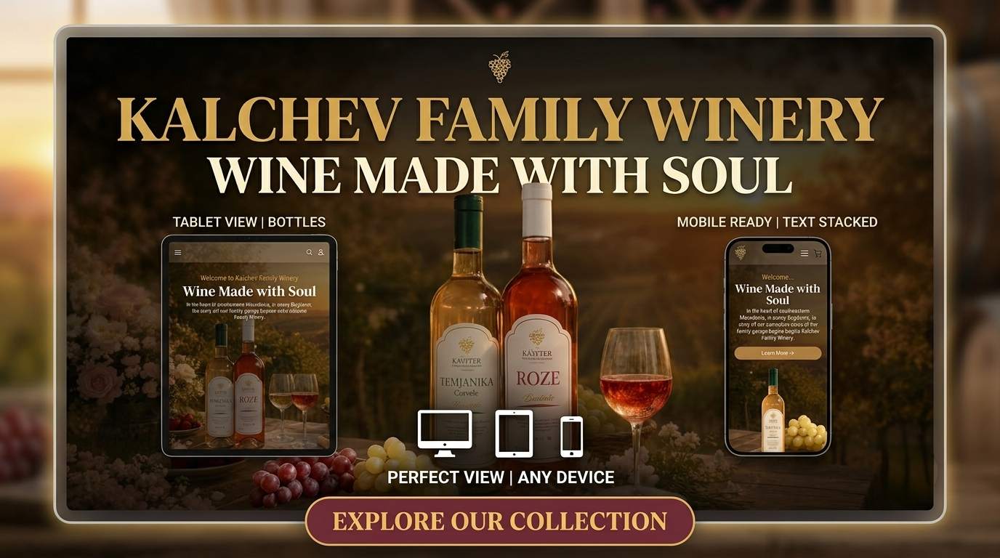

# Kalchev Family Winery



Marketing website for Kalchev Family Winery — a family-owned winery in Bogdanci, Macedonia, crafting award-winning wines since 2008.

## Tech Stack

| Layer | Technology |
|-------|-----------|
| Framework | [Next.js 15](https://nextjs.org) (App Router) |
| Language | TypeScript (strict) |
| Styling | [Tailwind CSS](https://tailwindcss.com) + [shadcn/ui](https://ui.shadcn.com) |
| Animation | [Framer Motion](https://www.framer.com/motion/) |
| Database | [Neon](https://neon.tech) PostgreSQL + [Drizzle ORM](https://orm.drizzle.team) |
| Forms | React Hook Form + Zod |
| Tests | Vitest, Playwright |
| CI/CD | GitHub Actions + [Vercel](https://vercel.com) |

## Getting Started

```bash
# Install dependencies
pnpm install

# Set up environment
cp .env.example .env.local
# Edit .env.local with your DATABASE_URL (Neon PostgreSQL)

# Run migrations
pnpm db:push

# Start dev server
pnpm dev
```

Open [http://localhost:3000](http://localhost:3000).

## Scripts

| Command | Description |
|---------|-------------|
| `pnpm dev` | Development server |
| `pnpm build` | Production build |
| `pnpm lint` | ESLint |
| `pnpm format` | Prettier |
| `pnpm test:unit` | Unit tests (Vitest) |
| `pnpm test:integration` | Integration tests (Testcontainers) |
| `pnpm test:e2e` | E2E tests (Playwright) |
| `pnpm test:all` | All tests |
| `pnpm typecheck` | Type checking |
| `pnpm db:generate` | Generate Drizzle migrations |
| `pnpm db:migrate` | Apply migrations |
| `pnpm db:studio` | Drizzle Studio |

## Project Structure

```
app/               Next.js App Router pages, layouts, API routes
components/        React components (sections, cards, cart, ui)
config/            Site configuration and metadata
data/              Static content with 3-language translations
drizzle/           Database migrations
hooks/             Custom React hooks
lib/               Utilities, DB, i18n, server actions, schemas
public/            Static assets
types/             TypeScript type definitions
e2e/               Playwright end-to-end tests
```

## Features

- **Wine Gallery** — filter by type, search, sort, detail modals with tasting notes and food pairings
- **Shopping Cart** — localStorage persistence, add/remove/update quantities
- **Wine Club** — 3-tier membership (Basic, Premium, VIP)
- **Internationalization** — English, Macedonian, Greek
- **Dark Mode** — class-based toggling
- **Contact Form** — rate-limited, validated with Zod
- **SEO** — JSON-LD structured data, Open Graph images, sitemap, robots.txt
- **Responsive** — mobile-first design across all breakpoints

## Database

Neon Serverless PostgreSQL with Drizzle ORM. If `DATABASE_URL` is not set, the app runs without the database (contact forms and newsletter signups are logged locally).

**Tables:** `contact_submissions`, `wine_inventory`, `newsletter_subscribers`

## License

MIT
